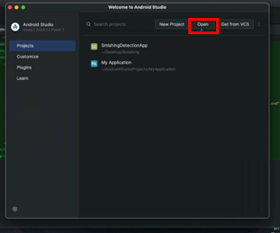
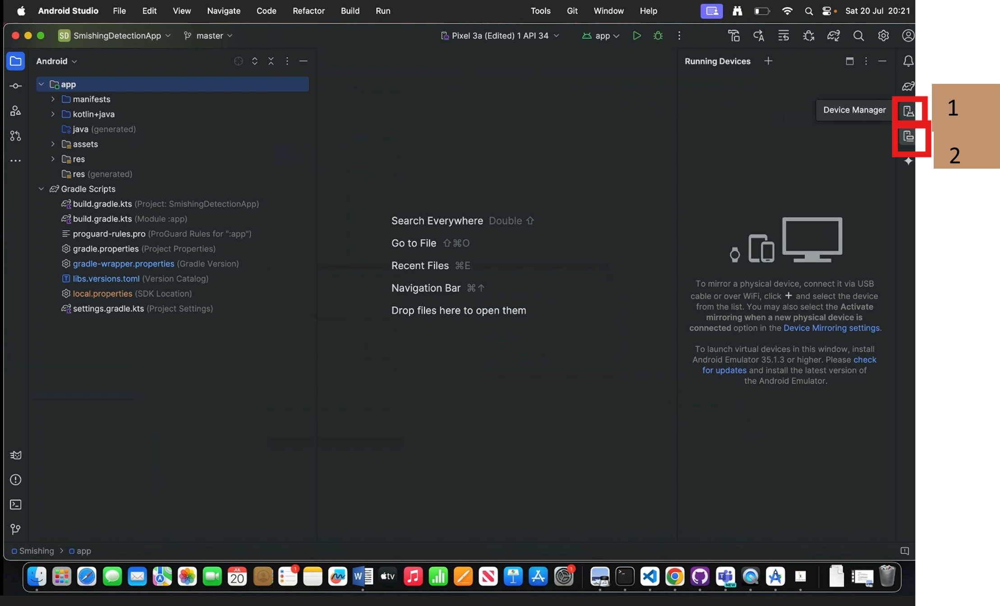
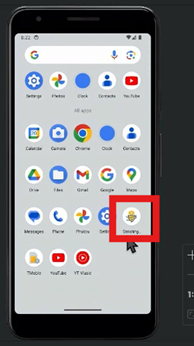
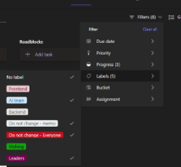
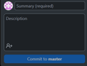
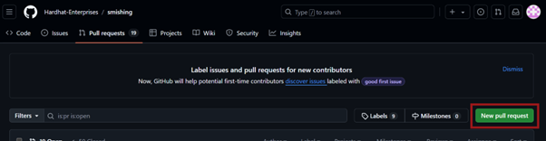
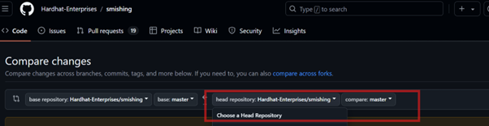

# Onboarding Guide

## Table of content

[Tool installation](#tool-installation)

- [GitHub](#github) (Branches) (after tri2 2024)
- [Android Studio](#android-studio)
- [Planner](#planner) (replacing Trello)

[Contributing to GitHub - making pull requests](#contributing-to-github)

- Contrubuting your changes using GitHub (branches)

[Forking GitHub (before t2 2024)](#github-forking-before-t2-2024)

[Making pull requests (forked)](#contributing-your-changes-using-github-forked)

---

## Tool installation:

### GitHub (Branches) (after tri2 2024)

Install Git/GitHub.

Command line: Windows git bash from here: [https://gitforwindows.org/](https://gitforwindows.org/) 

Or user interface app: GitHub desktop app download: [https://desktop.github.com](https://desktop.github.com)

#### Access preparation (GitHub leads)

- Make sure the master branch is protected
- Collect project member GitHub accounts
- GitHub leads with owner access of the repo add project members to the repo (add to teams in Hardhat organisation on GitHub)
- Give access to leads and code reviewer access to master branch (edit and approve pull requests)

#### Cloning GitHub

Go to the company repository: [GitHub - Hardhat-Enterprises/smishing: An AI-drive model driven to discern the legitimacy of SMS messages.](https://github.com/Hardhat-Enterprises/smishing)


Select ‘Open with GitHub Desktop’ and clone in GitHub desktop

OR

if you’re using GitHub desktop:

Click Current repository > add> clone repository > URL > paste URL and select the local path you want to clone it to

OR

Copy the URL, using git CML go to the directory you want the folder to be in, then clone to your computer


Then click ‘current branch’, create a new branch with your name based on master branch


Or on GitHub website: *branch name* (master) > switch branches/tags > view all branches > new branch

**More detailed tutorial at:**

[Capstone GitHub guide](https://verdant-raindrop-f3e404.netlify.app/capstonetraining/github/1-intro-to-github/)

[GitHub tutorial link](https://teams.microsoft.com/l/message/19:fcf7182e687d40cea36fcdbbd3e80624%40thread.tacv2/1720657256571?tenantId=d02378ec-1688-46d5-8540-1c28b5f470f6&groupId=e088b855-7f73-4a79-a2ed-f377a22cc398&parentMessageId=1720657256571&teamName=Deakin%20SIT%20Capstone%20Cohorts&channelName=%F0%9F%90%B1%E2%80%8D%F0%9F%92%BBGitHub%20Workshop%20and%20Support&createdTime=1720657256571) (2024 T2) (there could be new workshop every tri)

    posted in Deakin SIT Capstone Cohorts / 🐱‍💻GitHub Workshop and Support

    Recording in the comments

[Git Guide](https://github.com/git-guides)

---

### Android studio

After forking and cloning GitHub repository, download and install Android studio

Android Studio Download: [Download Android Studio & App Tools - Android Developers](https://developer.android.com/studio)

Open the **local path** where you’ve cloned your GitHub

  


1: Device manager > run > 2: running devices

 

When there’re pop ups about updating AGP, click update > run selected steps. It might take a while.


This is our app



More detailed tutorial at:

[Android Studio install video tutorial](https://deakin365-my.sharepoint.com/:v:/g/personal/njiang_deakin_edu_au/EbTBTEfRRc1AjiwqQXHRK40BmbIoVsPwatnrUkiD0RlS3A?e=a4wZUf)

 ---

### Planner (replacing Trello)

Tasks of each team are separated by labels, use filter function to hide other teams



1. Tasks of each team are separated by labels, use filter function to hide other teams 
   
   - [Common problem] tasks disappearing!: no tag added and not showing 'no label' in filter

2. When adding new tasks, remember to pick labels

3. Pick a task by assigning yourself to the card in backlog

4. Start working: Move task from backlog to sprint in progress, comment you've started working, and update the comments as you progress, including any documentation

5. Join a task to collaborate: First communicate with the other people on the card to ask about their progress to avoid repeated work

6. Finishing a task: move to completed

7. Feel free to come up with new task ideas for yourself and the project! But check with team leaders or the mentor first

---

## Contributing to GitHub

### Contrubuting your changes using GitHub (branches)

Now you should have made a branch on the Hardhat company repository and cloned to your computer, and made changes in the cloned folders.

#### 1. Regular commits to save changes

On GitHub Desktop: write a summary and make a commit



Using Git CMD:

```
git commit -m "summary message"
```

#### 2. Regularly update your branch from upstreams

on GitHub Desktop: Branches > Update from master


#### 3. Resolve conflicts

Fetch origin


Resolve conflicts 


> (Personally I like using vscode since it can recognise conflict notation)

> To open in vscode, if your default editor is Android Studio, you can change it by:

> File > Options > Integrations > External editor > Visual Studio Code > Save

> In MacOS it could be GitHub Desktop > Settings/Preferences

> Use the same process to change to other editors

Make sure the app is working after your changes and commit any changes 

Push the local commits to origin


#### 4. Make pull requests

On company GitHub website [Compare · Hardhat-Enterprises/smishing · GitHub](https://github.com/Hardhat-Enterprises/smishing/compare)



Choose the master branch (or AI-models) as head, your branch as compare > Create pull request.




---

### GitHub (forking, before T2 2024)

Install Git. For windows use git bash from here: [https://gitforwindows.org/](https://gitforwindows.org/) 

GitHub desktop app download: [https://desktop.github.com](https://desktop.github.com)

Fork the smishing detection repo [GitHub - Hardhat-Enterprises/smishing: An AI-drive model driven to discern the legitimacy of SMS messages.](https://github.com/Hardhat-Enterprises/smishing) to your account

** For the AI team, we do need to **unclick** ‘copy the
main branch only’, as we will be using the AI-Models branch

Go to your own repository, copy the URL

Then clone to your computer

Or if you’re using GitHub desktop:

Click Current repository > add> clone repository > **URL** > paste URL of your repository and the **local path** you want to save it
to

More detailed tutorial at:

[Capstone GitHub guide](https://verdant-raindrop-f3e404.netlify.app/capstonetraining/github/1-intro-to-github/)

[GitHub tutorial link](https://teams.microsoft.com/l/message/19:fcf7182e687d40cea36fcdbbd3e80624@thread.tacv2/1720657256571?tenantId=d02378ec-1688-46d5-8540-1c28b5f470f6&groupId=e088b855-7f73-4a79-a2ed-f377a22cc398&parentMessageId=1720657256571&teamName=Deakin%20SIT%20Capstone%20Cohorts&channelName=%F0%9F%90%B1%E2%80%8D%F0%9F%92%BBGitHub%20Workshop%20and%20Support&createdTime=1720657256571)

posted in Deakin SIT
Capstone Cohorts / 🐱‍💻GitHub Workshop and Support

There's a recording in the comments

### Contributing your changes using GitHub (forked)

Now you should have made a fork of the company repository and
cloned it to your computer, and the changes you made are on the cloned folders.

#### 1. Regular commits to save changes

On GitHub Desktop: write a summary and make a commit


 Using Git CMD:

```
git commit -m "summary message"
```

#### 2. Regularly update your branch from upstream (company repo)

Sync fork with company repo 

On GitHub website:


On GitHub Desktop:


Using Git CMD:

```
git remote add upstream https://github.com/Hardhat-Enterprises/smishing.git
git fetch upstream
git merge upstream/master
git push origin master
```

#### 3. Refresh origin (sync changes from remote to your computer)

On GitHub Desktop


#### 4. Make pull request


Choose the branch you made the commit


When it says ‘able to merge’ with no conflicts, make some comments about what you’ve done and create the pull request


